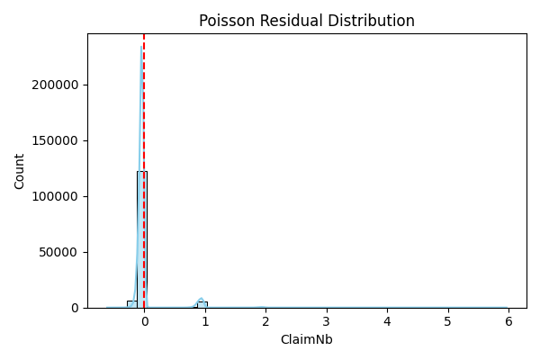
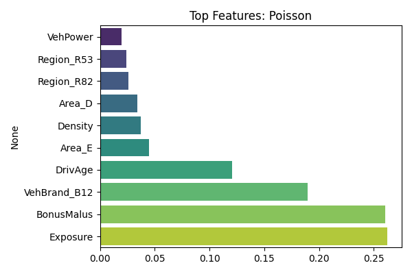
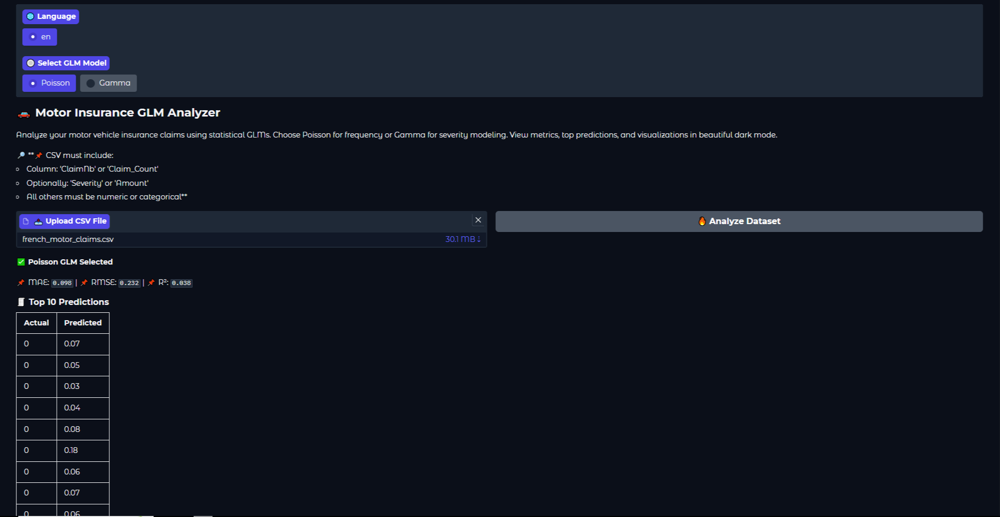
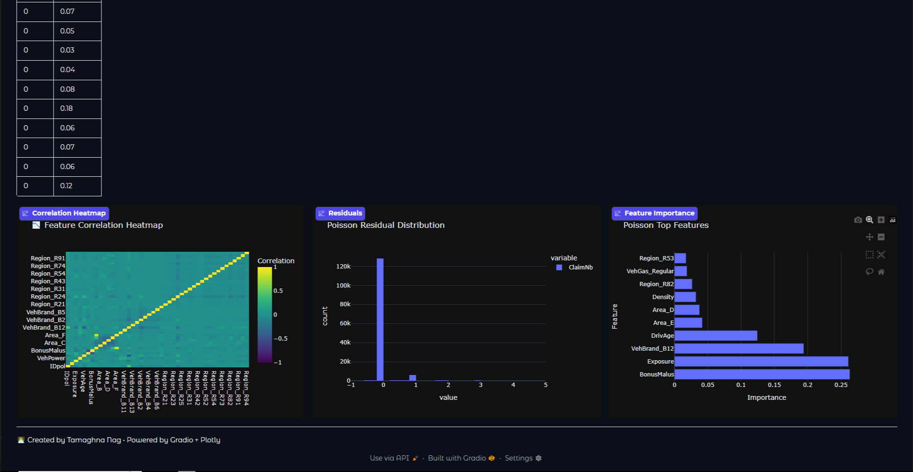

# 🚗 Insurance Claim Analyzer with GLMs


> 📊 Analyze motor insurance claim data using **Generalized Linear Models** — Poisson for frequency, Gamma for severity.  
> 💡 Hosted via Gradio, powered by scikit-learn, and visualized with Plotly (dark mode).  
> 🔁 Fully local & privacy-friendly. Supports multilingual UI and downloadable insights!

---

## 🧠 Key Features

- ✅ **Poisson GLM** for claim frequency (count data)
- ✅ **Gamma GLM** for claim severity (positive continuous values)
- ✅ Auto preprocessing (one-hot encoding, scaling, feature cleanup)
- ✅ 📈 Residual diagnostics & visualizations
- ✅ 📊 Feature importance (per model)
- ✅ Multilingual UI (English 🇬🇧, Spanish 🇪🇸, German 🇩🇪)
- ✅ Downloadable results bundle (.zip)
- ✅ Toggle between models in-app
- ✅ Dark-themed visualization via **Plotly**
- 🔐 No cloud calls. Entirely local or deployable to Hugging Face Spaces.

---

## ⚙️ Tech Stack

| Layer         | Tool/Library                              |
|--------------|--------------------------------------------|
| Language      | Python 3.9+                               |
| Models        | `PoissonRegressor`, `GammaRegressor` (scikit-learn) |
| Interface     | Gradio                                    |
| Visualization | Plotly (Dark Theme)                       |
| Tracking      | Weights & Biases (optional)               |
| Deployment    | Hugging Face Spaces, Localhost            |

---

## 🗂️ Folder Structure

```bash
Insurance_GLM/
│
├── app.py                     # Gradio UI
├── train_poisson.py          # Poisson GLM pipeline
├── train_gamma.py            # Gamma GLM pipeline
├── evaluate_and_compare.py   # Evaluation logic
├── requirements.txt
├── README.md
│
├── config/
│   └── config.yaml            # Model and app configs
├── data/
│   └── french_motor_claims.csv
├── models/
│   └── *.pkl                  # Trained models
├── results/
│   └── *.png, *.html, *.zip   # Visualizations & prediction exports
├── notebooks/
│   └── *.ipynb                # EDA and training workflows
├── src/
│   ├── preprocessing.py
│   ├── data_loader.py
│   ├── model_poisson.py
│   ├── model_gamma.py
│   └── utils.py
├── logs/                     # W&B or manual logs
└── .gradio/                  # App-specific Gradio cache
````

---

## 🚀 Getting Started

### 🔧 Install Dependencies

```bash
pip install -r requirements.txt
```

### ▶️ Launch the App

```bash
python app.py
```

* App runs locally at `http://127.0.0.1:7860`
* Upload a `.csv` file with at least:

  * `'ClaimNb'` or `'Claim_Count'`
  * Optional: `'Severity'` or `'Amount'`
* App auto-selects best GLM model & displays insights.

---

## 📊 Visualizations

### 🔍 Model Insights

| Residuals                       | Feature Importance                                     |
| ------------------------------- | ----------------------------------------------------- |
|  |  |

Visuals auto-update based on selected model (Poisson or Gamma).

---

### 🖥️ App Visuals (Gradio Interface)

| Home Page                       | Analysis Display                                     |
| ------------------------------- | --------------------------------------------------- |
|        |                            |

This is how your GLM Analyzer looks and feels — dark, modern, and intuitive.

---

## 📄 Dataset Requirements

Your `.csv` file should have:

| Column                | Description                             |
| --------------------- | --------------------------------------- |
| `ClaimNb`             | (required for Poisson) number of claims |
| `Severity` / `Amount` | (optional for Gamma) cost per claim     |
| Other columns         | Numeric or categorical features         |

---

## 🛠️ Next Features (Planned)

* 📈 SHAP-based interpretability
* 🧠 Add Bayesian GLMs
* 💻 Streamlit Pro dashboard mode
* 🗃️ Export feature statistics
* 🌐 Additional language support

---

## 🌍 Deployment

Deploy this on:

* ✅ Localhost (runs via Python)
* ✅ [Hugging Face Spaces](https://huggingface.co/spaces)
* ☁️ Docker & Cloud (optional)

---

## 🧑‍💻 Author

**Tamaghna Nag**
👨‍🎓 Postgrad in Computing | 💼 AI Engineer | 🚀 Founder, NovalQ
🔗 [Portfolio](https://tamaghnatech.in)
🔗 [LinkedIn](https://www.linkedin.com/in/tamaghna99/)
🔗 [GitHub](https://github.com/Tamaghnatech)

---

## 📜 License

This project is released under the [MIT License](LICENSE).

---

## 💬 Acknowledgements

* `scikit-learn` for GLMs
* `Gradio` for easy UI
* `Plotly` for sleek dark plots
* `Weights & Biases` for logging

---

## ⭐ Like What You See?

If this helped you build a dashboard or predict risk:

> Show some love — ⭐ the repo and share with your data gang 🧠🔥

---
---

## 👨‍💻 About the Developer

Built with passion by **Tamaghna Nag** — AI Engineer, creator of NovalQ, and lifelong builder of intelligent systems.  
Always learning, always shipping. 🚀

